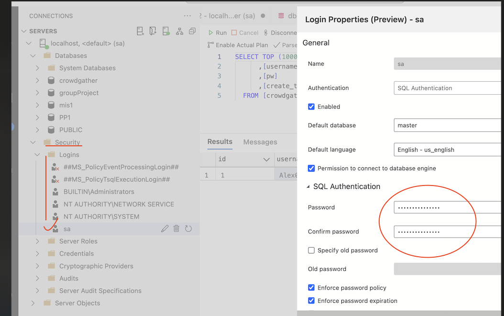

## 檔案

- Areas.sql
- Citys.sql
- UserImg.sql
- Userinfo.sql
- HibernateUtil.java
    - 連接池：隨贈的，第一行 package 記得改
- hibernate.cfg.xml
    - DataBase：crowdgather
    名字我先取個，之後再討論更好的命名
    - username：sa
    - password：P@ssw0rd
    * 因為 Azure Data Studio 密碼不能改成 1234，所以乾脆就用 P@ssw0rd ，這邊就麻煩大家了，不好意思了😓
        - Azure Data Studio
            
            
            

## 資料庫

- Userinfo
    - Userinfo Summary
        
        
        |  | Column Name | Data Type | Constraints | References | value |
        | --- | --- | --- | --- | --- | --- |
        | 會員編號 | *userid | INT | NOT NULL, PRIMARY KEY, IDENTITY(1,1) |  |  |
        | 帳號（電子信箱） | uAccountEmail | *NVARCHAR(30) | NOT NULL,*UNIQUE KEY |  |  |
        | 密碼 | uPwd | *NVARCHAR(20) | NOT NULL |  |  |
        | 姓名 | uName | NVARCHAR(25) | NOT NULL |  |  |
        | 暱稱 | uNickname | NVARCHAR(10) |  |  |  |
        | 性別 | uGender | CHAR(1) |  |  | 女：F / 男：M / 其他：O |
        | 生日 | uBirthday | DATE |  |  |  |
        | 電話 | uTel | VARCHAR(25) | NOT NULL |  |  |
        | 居住地（市） | addCityid | INT |  | Citys(addCityid) |  |
        | 居住地（區） | addAreaid | INT |  | Areas(addAreaid) |  |
        | 身分證 | uIdCode | CHAR(10) |  |  |  |
        | 權限 | roleId | INT |  | # |  |
        | 頭貼 ID | userImgId | INT |  | UserImg(userImgId) |  |
    
    ### 簡述
    
    - 會員編號
        - userid
        - Primary Key
        - 流水號
    - 帳號
        - Mail
        - Unique Key
        - 30 字為限
    - 密碼
        - 密碼長度7~20字，含英文字母和數字，不可空格，支援特殊字元 #?!@$%^&*-_
        - 請輸入8-16位英文字母與數字混和之密碼
    - 姓名
    20 字 為限（參照台灣最大取名）
        - 姓名極端範例
            
            
            
    - 暱稱
        - 10 字為限
    - 性別
        - 女：F
        - 男：M
        - 其他（不願意透露）：O (OTHER)
    - 生日
    - 個人頭貼
        - ~~拉一個Table圖片儲存位置，往後維護比較方便？~~
        - userImgId
        - 參照 **[UserImg](https://github.com/bochen0116/2rd_group_presentation/blob/main/UserImg.sql) Table**
    - 電話
        - 區號 (+886 、+81) + 請輸入 7~20 碼數字
        - 25 字
    - ~~居住區~~
        - ~~額外拉兩個表出來，可以給活動表單使用（?）~~
        - ~~城市：台北,台南,……~~
        - ~~區域：（台北）中山區,（台南）東區~~
    - 居住地（市）
        - iaddCityid
        - 參照 **[Citys](https://github.com/bochen0116/2rd_group_presentation/blob/main/Citys.sql) Table**
    - 居住地（區）
        - addAreaid
        - 參照 **[Areas](https://github.com/bochen0116/2rd_group_presentation/blob/main/Areas.sql) Table**
    - 身分證
        - 10 字
        - 居留證或入出境許可證(2碼英文+8碼數字)
        - 國人身分證字號格式修正(**1碼英文+9碼數字**)
    - 權限
        - Foreign key
        - roleId
        - 參照 role **Table**
    
    ---
    
- UserImg‎
    
    
    |  | Column Name | Data Type | Constraints | References | value |
    | --- | --- | --- | --- | --- | --- |
    | 頭貼圖片編號 | userImgid | INT | NOT NULL, PRIMARY KEY, IDENTITY(1,1) |  |  |
    | 會員編號 | userId | INT | NOT NULL | Userinfo(userId) |  |
    | 頭貼圖片存取路徑 | uImgpath | NVARCHAR(255) | NOT NULL |  |  |